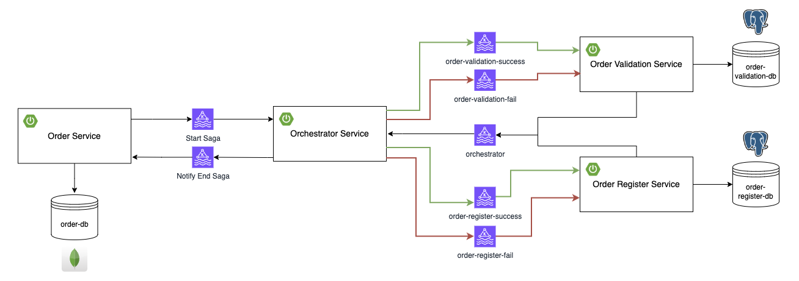

# Padrão Saga Orquestrado

Este projeto tem a finalidade de ser um projeto de estudos para colocar em prática tudo que foi aprendido sobre o padrão Saga Orquestrado. Que é um padrão utilizado quando se trabalha com arquitetura de microsserviços, é um padrão que resolve o problema de inconsistência de dados quando utilizamos transação distribuída nos microsserviços.

O projeto foi pensado para simular o processo de compra e venda de ativos da bolsa de valores, onde toda compra ou venda de um ativo (ação ou fundo imobiliário) gera um novo pedido, e nesse projeto vamos simular esse processo utilizando a arquitetura de microsserviços e o padrão saga onde será garantido a consistência dos dados.

# Desenho da Solução




# Tecnologias

- Java 17
- Spring Boot
- Apache Kafka
- Docker
- PostgreSQL
- MongoDB
- Redpanda Console

# Microsserviços

**order-service:** Microsserviço responsável por receber as informações do pedido, criar o pedido, inicar e encerrar toda a saga.

**orchestrador-service:** Microsserviço responsável por realizar toda a orquestração da saga, além disso é responsável por conhecer os outros microsserviços.

**order-validation-service:** Nesse microsserviço é realizado algumas validações: verificar se o cliente tem saldo o suficiente para realizar a compra do ativo, ou se for uma operação de venda, verifica se o cliente tem a quantidade de ativos o suficiente para vender. Além disso bate na API externa para recuperar o preço atual do ativo e realizar o cálculo total do pedido. E por fim realiza a atualização da posição do cliente.

**order-register-service:** Aqui todos os detalhes do pedido será gravado e um e-mail será enviado para o cliente dizendo que o pedido foi executado com sucesso.

# Configurando o projeto

Antes de rodar os projetos será necessário realizar algumas configurações:

1. Entre no arquivo `application.properties` do projeto `ordervalidationservice` e altere a linha `api.finance.key` colocando o token que é criado ao se cadastrar e se inscrever no site [Real-Time Finance Data](https://rapidapi.com/letscrape-6bRBa3QguO5/api/real-time-finance-data/)

2. Entre no arquivo `application.properties` do projeto `orderregisterservice` e altere as linhas `spring.mail.username` e `spring.mail.password` colocando um e-mail e senha respectivamente.

# Rodando o projeto

> Antes de rodar o projeto é necessário ter o docker instalado

Para rodar o projeto siga os seguintes passos:

1. Execute o arquivo **docker-compose** que está na raiz do projeto para subir os serviços necessários:
``` shell
docker-compose up --build -d zookeeper kafka redpanda-console order-db order-validation-db order-register-db
```

2. Execute cada microsserviço individualmente dentro da IDE que esteja utilizando ou execute o projeto através do **maven**. Para isso entra na pasta de cada serviço e execute o seguinte comando:
``` shell
./mvnw spring-boot:run
```

# Testando o fluxo

Para criar um pedido e iniciar toda a saga é necessário realizar um **POST** para o seguinte endpoint: http://localhost:3000/api/order

Exemplo de requisição para passar no body:

``` json
{
  "customerDocument": "27242216052",
  "tickerSymbol": "PETR4",
  "tradeQuantity": 5,
  "operation": "BUY"
}
```

Para buscar o pedido e acompanhar o andamento da saga é necessário realizar um **GET** para os seguintes endpoints, filtrando por **order id** ou **transaction id**:

http://localhost:3000/api/event?orderId=655bdca64867ff706f47e0af

http://localhost:3000/api/event?transactionId=1700407203438_04ec59d1-8e1a-4794-89f9-b160bb9a6de2

Exemplo de resposta:

``` json
{
  "id": "655bdbd74867ff706f47e0ac",
  "transactionId": "1700518871921_47e14c2c-afdb-44b5-aa4d-26a418da7af0",
  "orderId": "655bdbd74867ff706f47e0ab",
  "order": {
    "id": "655bdbd74867ff706f47e0ab",
    "costumer": {
      "name": "Joaquim Ferreira",
      "document": "27242216052",
      "email": "joaquim.ferreira@gmail.com"
    },
    "orderDetail": {
      "tickerSymbol": "PPAS3",
      "tradeQuantity": 7,
      "operation": "BUY",
      "total": 356.51
    },
    "createdAt": "2023-11-20T19:21:11.913"
  },
  "source": "ORCHESTRATOR",
  "status": "SUCCESS",
  "histories": [
    {
      "source": "ORCHESTRATOR",
      "status": "SUCCESS",
      "message": "Saga started!",
      "createdAt": "2023-11-20T19:21:11.952"
    },
    {
      "source": "ORDER_VALIDATION_SERVICE",
      "status": "SUCCESS",
      "message": "Order are validated successfully!",
      "createdAt": "2023-11-20T19:21:13.346"
    },
    {
      "source": "ORDER_REGISTER_SERVICE",
      "status": "SUCCESS",
      "message": "Order register successfully!",
      "createdAt": "2023-11-20T19:21:13.378"
    },
    {
      "source": "ORDER_REGISTER_SERVICE",
      "status": "SUCCESS",
      "message": "Email successfully sent!",
      "createdAt": "2023-11-20T19:21:16.934"
    },
    {
      "source": "ORCHESTRATOR",
      "status": "SUCCESS",
      "message": "Saga finished successfully!",
      "createdAt": "2023-11-20T19:21:16.971"
    }
  ],
  "createdAt": "2023-11-20T19:21:16.983"
}
```

# API externa

API utilizada para consultar os preços dos ativos será a [Real-Time Finance Data](https://rapidapi.com/letscrape-6bRBa3QguO5/api/real-time-finance-data/). Ao se cadatrar na plataforma RapidApi podemos utilizar o plano grátis, onde podemos fazer 100 requisições por mês para a API.

# Autor

### Nicolas Rezende
